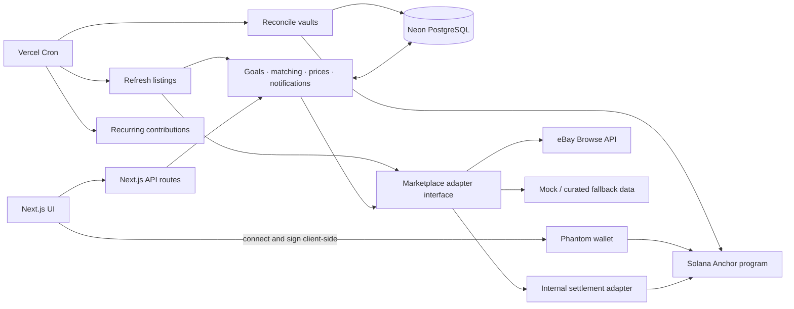

# RIVESEEK

RIVESEEK (working product name: **Grail**) is a Solana-powered collectible discovery and savings platform. It helps collectors find exact-match marketplace listings, compare total cost and seller signals, and reserve funds in an on-chain goal vault until a trustworthy match is affordable.

> The MVP is an on-chain settlement proof of concept, not a second marketplace. Its internal marketplace demonstrates escrow → purchase → asset transfer with a small number of seeded assets; eBay remains the primary external marketplace.

## MVP focus

The MVP prioritizes depth in the three highest-risk systems:

1. **Exact-match engine** — turns messy marketplace titles into structured attributes and classifies listings with per-attribute confidence.
2. **On-chain goal vault** — stores the authoritative goal balance and status on Solana, with an off-chain mirror for application queries.
3. **eBay adapter** — imports Browse API search and item details through a shared marketplace-adapter contract.

Supporting features are intentionally minimal: seeded catalogue data, wishlist and goal CRUD, a mock adapter, price snapshots with one chart, debounced notifications, basic seller-trust display, recurring contributions, and a 1–3 asset internal settlement demo.

## Product principles

- **Never guess an exact match.** Low-confidence listings are surfaced as `needs_review` rather than silently promoted.
- **On-chain is authoritative.** Vault balance and goal status are read from Solana and reconciled into the database; stale mirrors are visibly marked.
- **Human review is part of the MVP.** Collectors can confirm or reject uncertain listings for their own goal, while an internal review queue records corrections as labeled examples.
- **External checkout stays external.** RIVESEEK redirects collectors to the source listing; eBay ordering, bidding, and checkout are out of scope.
- **Keep integrations replaceable.** eBay, mock data, and the internal settlement adapter implement the same marketplace interface.

## Exact-match pipeline

Listings pass through a tiered pipeline:

```text
raw title
   ↓
cleanup (case, whitespace, emoji, abbreviations)
   ↓
structured extraction (regex + controlled vocabulary)
   ↓
fuzzy matching (catalogue names and sets)
   ↓
confidence scoring per required attribute
   ├─ exact / flexible / alternative
   └─ needs_review / rejected
```

Required attributes below their confidence threshold always route to `needs_review`. Evaluation uses roughly 50–100 curated titles, including emoji, typos, l33tspeak, wrong sets, wrong grades, and ungraded items. The target is to keep the `needs_review` rate around 25–30% or lower on the curated test set while reporting precision and recall honestly.

## Architecture

The application is planned as one TypeScript Next.js project deployed to Vercel. Frontend pages/components and backend API routes share the project. Neon/PostgreSQL stores catalogue data, listings, match results, price snapshots, notifications, and the off-chain goal mirror.



### Planned stack

| Layer | Technology | Responsibility |
| --- | --- | --- |
| Web application | Next.js + TypeScript | UI and server-side API routes |
| Database | Neon / PostgreSQL | Off-chain application data and derived mirrors |
| Wallet | Phantom + Solana wallet adapter | Browser connection and client-side transaction signing |
| Blockchain | Solana devnet + Anchor/Rust | Goal vaults, deposits, withdrawals, and settlement |
| Assets | Metaplex Core | 1–3 seeded internal marketplace assets |
| Scheduling | Vercel Cron | Refresh, reconciliation, and recurring-contribution triggers |
| Marketplace | eBay Browse API | Search and item-detail ingestion |

## Data authority and reliability

On-chain vault balance and goal status are always authoritative. The database mirror is refreshed on the same cadence as price tracking and is labeled with its last-read timestamp. Before critical actions such as purchase confirmation, the application performs an on-demand chain read. RPC failures preserve the last-known mirror with a stale indicator and block writes that depend on stale state.

The eBay integration begins with a Week-1 validation spike covering production entitlements, Browse API access, response quality, scopes, and rate limits. If live access is unavailable or unsuitable, the same adapter contract uses a hand-curated messy-title dataset for development, benchmarking, and demonstrations; that dataset must not be represented as live eBay data.

## Notifications and scheduled work

Notifications are debounced per `(goal_id, event_type)` over a rolling 24-hour window. Multiple event types in that window are batched into one notification. Scheduled serverless functions handle:

- adaptive price and availability refreshes;
- on-chain reconciliation into the database mirror; and
- recurring contribution submission when the required narrowly scoped service signer is securely configured.

If the deployment plan cannot support more-than-daily cron execution, the MVP falls back to daily refresh plus rate-limited manual refresh. Recurring contributions remain manual if secure delegate signing is not implemented.

## Project status

This repository is being initialized from the MVP product requirements and architecture decisions. Implementation, infrastructure configuration, and deployment setup are the next milestones.

## Planned milestones

1. Scaffold the Next.js/TypeScript application and database schema.
2. Run the eBay production/sandbox validation spike and lock the adapter contract.
3. Build the catalogue, matching pipeline, confidence model, and review flows.
4. Implement and test the Anchor goal-vault program and Phantom transaction flow.
5. Add reconciliation, refresh scheduling, notifications, and minimal supporting screens.
6. Seed the internal settlement demo, benchmark matching quality, and deploy the MVP.

## Reference documents

- `Grail_MVP_PRD_v2.1.md` — cut-down MVP scope, product decisions, risks, and acceptance direction.
- `grail-architecture.mermaid` — first-pass system architecture and data flows.
